# Keycloak user migration plugin


[](https://sonarcloud.io/dashboard?id=keycloak-user-migration)
[](https://sonarcloud.io/dashboard?id=keycloak-user-migration)
[](https://sonarcloud.io/dashboard?id=keycloak-user-migration)
[](https://sonarcloud.io/dashboard?id=keycloak-user-migration)
[](https://sonarcloud.io/dashboard?id=keycloak-user-migration)
[](https://sonarcloud.io/dashboard?id=keycloak-user-migration)
[](https://sonarcloud.io/dashboard?id=keycloak-user-migration)

## Introduction

This is a user migration plugin for Keycloak. Read more at:

https://codesoapbox.dev/keycloak-user-migration

## Compatibility history

*(`SNAPSHOT` means that the version is not yet released)*

| Keycloak Version | Version/Commit                                                                                                                                     |
|------------------|----------------------------------------------------------------------------------------------------------------------------------------------------
| 26.X             | SNAPSHOT                                                                                                                                           |
| 25.X             | [5.0.0](https://github.com/daniel-frak/keycloak-user-migration/releases/tag/5.0.0)                                                                 
| 24.X             | [4.0.0](https://github.com/daniel-frak/keycloak-user-migration/releases/tag/4.0.0)                                                                 |
| 23.X             | [3.0.0](https://github.com/daniel-frak/keycloak-user-migration/releases/tag/3.0.0)                                                                 |
| 22.X             | [2.0.0](https://github.com/daniel-frak/keycloak-user-migration/releases/tag/2.0.0)                                                                 |
| 21.X             | [1.0.0](https://github.com/daniel-frak/keycloak-user-migration/releases/tag/1.0.0)                                                                 |
| 20.X             | [f4836a26aff16009738d5f6c74af0f8e69ba8d26](https://github.com/daniel-frak/keycloak-user-migration/commit/64e2fb30b7eac94ca944a5ef2759dcc5417ad9b2) |
| 19.X             | [f4836a26aff16009738d5f6c74af0f8e69ba8d26](https://github.com/daniel-frak/keycloak-user-migration/commit/f4836a26aff16009738d5f6c74af0f8e69ba8d26) |
| 18.X             | [4de28f2e2893b83911e79e242574fe3139144451](https://github.com/daniel-frak/keycloak-user-migration/commit/4de28f2e2893b83911e79e242574fe3139144451) |
| 17.X             | [ca82b795c793094f6d67dac3dc14dcdfd2d0ed59](https://github.com/daniel-frak/keycloak-user-migration/commit/ca82b795c793094f6d67dac3dc14dcdfd2d0ed59) |
| 16.X             | [489779543989b1880177c802f5ee62769a945b85](https://github.com/daniel-frak/keycloak-user-migration/commit/489779543989b1880177c802f5ee62769a945b85) |
| 15.X             | [922c69440a776f0cab80b68b90c90a6ba620cdd9](https://github.com/daniel-frak/keycloak-user-migration/commit/922c69440a776f0cab80b68b90c90a6ba620cdd9) |
| 12.X             | [0966d9ba7c94ba461783a5d8dda0735a35c4e6b8](https://github.com/daniel-frak/keycloak-user-migration/commit/0966d9ba7c94ba461783a5d8dda0735a35c4e6b8) |
| 11.x             | [9f59cdf7fa888c31c5cda3d1fe014c9a0682ab30](https://github.com/daniel-frak/keycloak-user-migration/tree/9f59cdf7fa888c31c5cda3d1fe014c9a0682ab30)   |
| 9.X              | [c9c64162b91cedc29d8bf360c3df50b69fdb4c6b](https://github.com/daniel-frak/keycloak-user-migration/tree/c9c64162b91cedc29d8bf360c3df50b69fdb4c6b)   |

### Note about compatibility with JBoss Keycloak distributions

Using this plugin with legacy JBoss distributions of Keycloak might result in a
`java.lang.NoClassDefFoundError: org/apache/commons/codec/binary/Base64` error. It seems
that [adding the maven-shade-plugin](https://github.com/daniel-frak/keycloak-user-migration/issues/72) as a dependency
fixes this issue.

## Prerequisites - REST endpoints in the legacy system

You must provide two REST endpoints (GET and POST) in your legacy authentication system under the
URI `${restClientUri }/{$username_or_email}`, where `${restClientUri}` is a configurable base URL for the endpoints and
`{$username_or_email}` is the username or e-mail of the user that is attempting to sign in.

**Note: it's important that the `GET` endpoint supports both username and e-mail, as otherwise the "forgotten password"
action will not work correctly until user migration is triggered.**

It is possible to configure the plugin to use the legacy `userId` instead of the username when making the credential
verification request. This option is useful if your legacy system allows users to change their usernames and should only
be used when the legacy user ids are migrated to Keycloak.

An example implementation of the REST endpoints is available in the `./docker/legacy-system-example` folder
(see: [UserMigrationController](docker/legacy-system-example/src/main/java/dev/codesoapbox/legacysystemexample/authentication/presentation/controllers/UserMigrationController.java)
class).

### GET

The GET request will have to return user data as a JSON response in the form:

```json
{
  "id": "string",
  "username": "string",
  "email": "string",
  "firstName": "string",
  "lastName": "string",
  "enabled": "boolean",
  "emailVerified": "boolean",
  "attributes": {
    "key": [
      "value"
    ]
  },
  "roles": [
    "string"
  ],
  "groups": [
    "string"
  ],
  "requiredActions": [
    "requiredActions"
  ],
  "totps": [
    {
      "name": "string",
      "secret": "string",
      "digits": "int",
      "period": "int",
      "algorithm": "string",
      "encoding": "string"
    }
  ]
}
```

Any HTTP status other than `200` will be interpreted as the user not having been found.

The `id` attribute in the above response is optional. If it's not set then Keycloak will generate a new user id
automatically.

### POST

The POST request is for password validation. It will have to accept the following body:

```json
{
  "password": "string"
}
```

...And return HTTP status 200 if the password is correct. Any other response will be treated as invalid credentials.

### Example REST client behavior

Let's assume we have configured the legacy REST service under the URL `http://www.old-legacy-system.com/auth`.

If a user with the username `bob` and the password `password123` tries to log in through Keycloak for the first time
(giving correct credentials), a GET request will be performed to `http://www.old-legacy-system.com/auth/bob`. The
response might look like this:

```json
{
  "id": "12345678",
  "username": "bob",
  "email": "bob@company.com",
  "firstName": "Bob",
  "lastName": "Smith",
  "enabled": "true",
  "emailVerified": "true",
  "attributes": {
    "position": [
      "rockstar-developer"
    ],
    "likes": [
      "cats",
      "dogs",
      "cookies"
    ]
  },
  "roles": [
    "admin"
  ],
  "groups": [
    "migrated_users"
  ],
  "requiredActions": [
    "CONFIGURE_TOTP",
    "UPDATE_PASSWORD",
    "UPDATE_PROFILE",
    "update_user_locale"
  ],
  "totps": [
    {
      "name": "Totp Device 1",
      "secret": "secret",
      "digits": 6,
      "period": 30,
      "algorithm": "HmacSHA1",
      "encoding": "BASE32"
    }
  ]
}
```

As the user has been found, its counterpart will be created in Keycloak and a federation link to the legacy system will
be created for it. That way, there will no longer be a need to make the GET request again
(but all credential checks will still go through the legacy system). After creating the user, a POST request will be
performed to `http://www.old-legacy-system.com/auth/bob`, with the body:

```json
{
  "password": "password123"
}
```

If the plugin is configured to use the user id as the path parameter for the credential verification request, the `POST`
request will be performed to `http://www.old-legacy-system.com/auth/12345678`, instead.

As this is the correct password, the user will be logged in. After the first successful login, the federation link to
the legacy system is severed and any interactions with the user will be done completely through Keycloak.
From this point onward, should the user change their information (e.g. password) in the legacy system,
**that information will not get updated in Keycloak**.

*If you need both the legacy system and Keycloak to be publicly accessible at the same time (which is not
recommended), you may need to modify this plugin to not sever the link. A good starting point is the
[LegacyProvider](https://github.com/daniel-frak/keycloak-user-migration/blob/c4aaa174fecfed9a58a3c2f7c80d7d2f300d0821/src/main/java/com/danielfrak/code/keycloak/providers/rest/LegacyProvider.java#L134)
class. Keep in mind that you would also need some way to update changes from Keycloak to your legacy system.*

## Launching and configuring the example

You can launch the demo Keycloak service and an example legacy service using Docker Compose. You can learn more about
the example legacy app in its [README.md](docker/legacy-system-example/README.md) file.

The following example uses the default `master` realm but the demo will also work with custom realms.

### Configuration

1. Run `mvn clean package` in the repository root
2. Navigate to `./docker`
3. Execute `docker compose up`
4. Open [http://localhost:8024/admin/](http://localhost:8024/admin/) in a browser
5. Log in with the credentials:

* User: `admin`
* Password: `admin`

6. Navigate to "User federation":

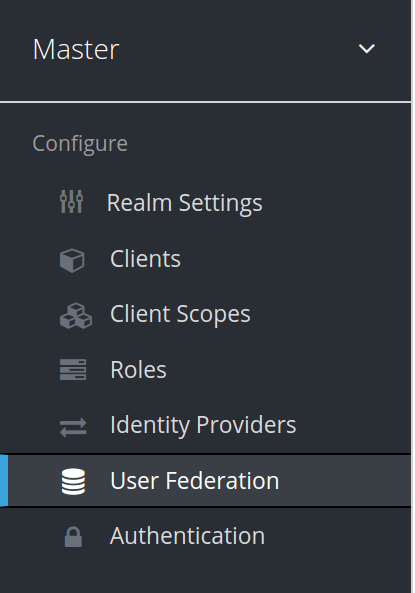

7. Choose "User migration using a REST client" from the "Add provider..." dropdown:

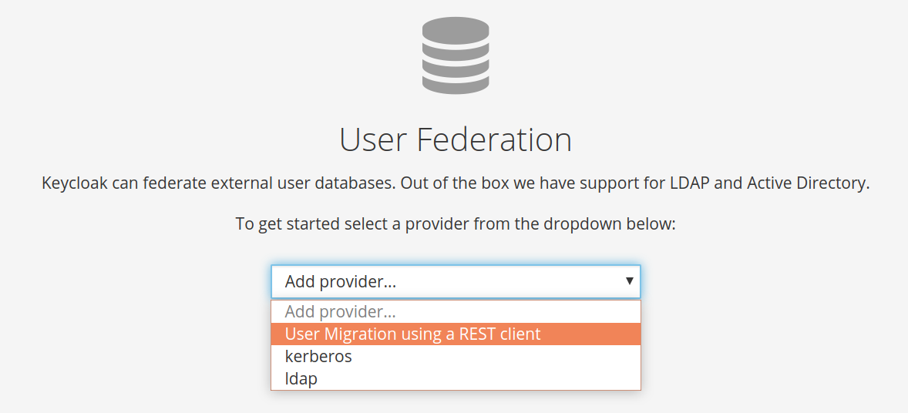

8. Provide the legacy system endpoint URI in the "Rest client URI" field. For the provided example legacy app the
   correct value is: `http://legacy-system-example:8080/user-migration-support`:

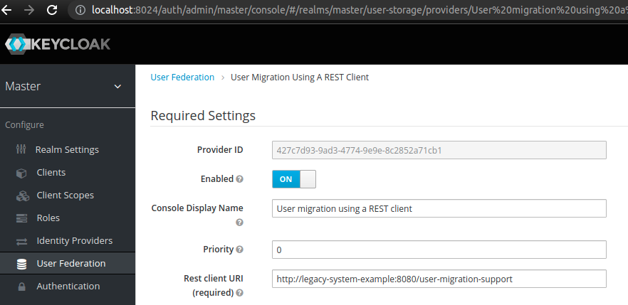

9. Click "save":

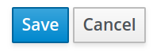

User migration should now work - Keycloak will recognize all users from your legacy authentication system and migrate
them automatically.

### Verification

1. Sign out from the admin account:

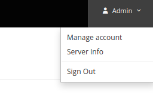

2. Go to the [http://localhost:8024/realms/master/account](http://localhost:8024/realms/master/account) URI.
   Click the `Sign in` button to login as an example user:

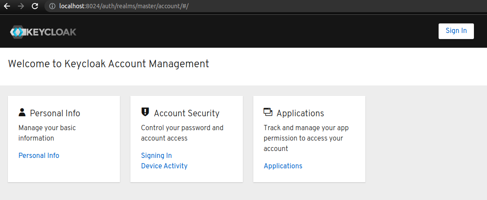

3. Enter user credentials [*] into the login form:

* Username: `lucy`
* Password: `password`

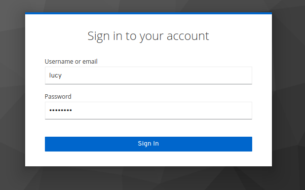

The example migrates the user with `Update Profile` as a required action. Therefore, we need to submit the profile data
to activate the user in Keycloak:

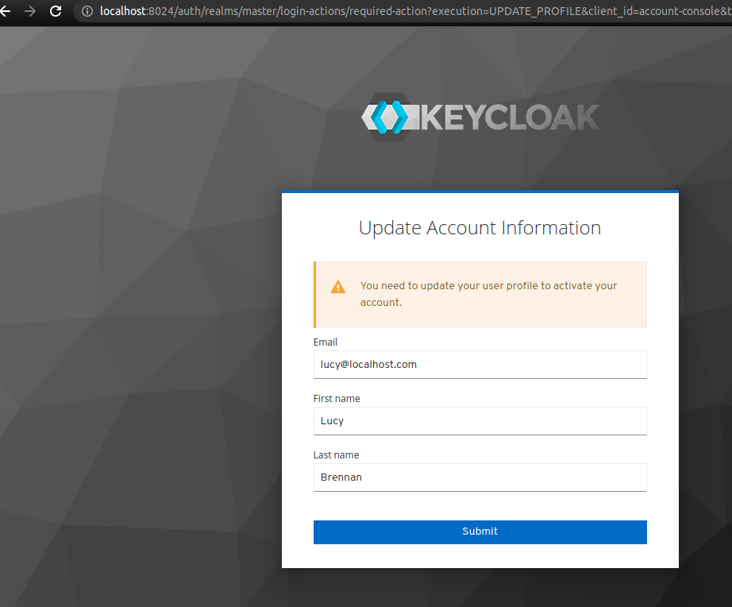

Setting `requiredActions`, `groups`, `attributes` or `roles` is completely optional and is included in the example
legacy system for illustration purposes only.

4. The example user is successfully migrated. Log in again as admin
   ([http://localhost:8024/admin/](http://localhost:8024/admin/)) and navigate to `Users` to verify the
   results:

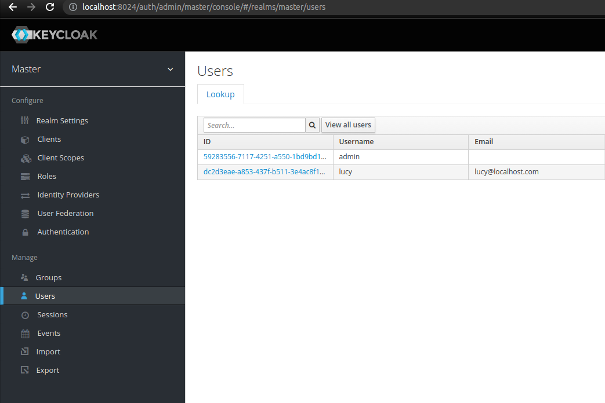

[*] You can find the list of available test users in the Swagger docs for the example legacy system:
[http://localhost:8080/swagger-ui.html](http://localhost:8080/swagger-ui.html) by calling the `/users` endpoint.

## Optional - additional configuration

Additional configuration options are available for fine-tuning the migration.

### Bearer Token Auth

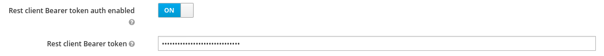

The migration endpoint can be secured with an API token. The configured value will be sent as a bearer token in the
authorization header.

If bearer auth is enabled, the configured token value is set to `SECRET_API_TOKEN` when making the request to the
migration endpoints, the rest client will send the following authorization header:

```
Authorization: Bearer SECRET_API_TOKEN
```

### Basic Auth for migration endpoint

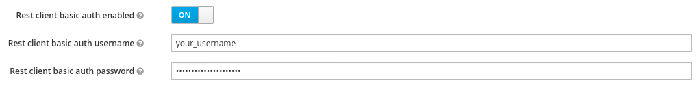

The migration endpoint can be secured with HTTP basic auth. The configured value will be sent as a Basic auth string in
the authorization header. Keep in mind that this approach is only secure over an encrypted connection (i.e. HTTPS)

If basic auth is enabled, the username and password will be sent in the authorization header:

```
Authorization: Basic base64encode(username:password)
```

### Legacy role conversion

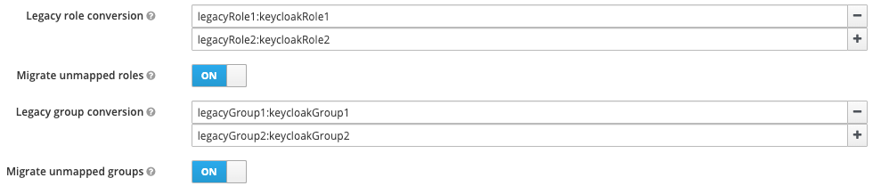

If role names in Keycloak do not perfectly match those in the legacy system, you can configure the provider to
automatically map legacy roles to Keycloak roles, by specifying the mapping in the format `legacyRole:keycloakRole`.

### Migrate unmapped roles

This switch can be toggled to decide whether roles which are not defined in the legacy role conversion map should be
migrated anyway or simply ignored.

### Group role conversion

If group names in Keycloak do not perfectly match those in the legacy system, you can configure the provider to
automatically map legacy groups to Keycloak groups, by specifying the mapping in the format `legacyGroup:keycloakGroup`.

### Migrate unmapped groups

This switch can be toggled to decide whether groups which are not defined in the legacy group conversion map should be
migrated anyway or simply ignored.

## Totp

This module supports the migration of totp devices. The totp configuration block could look like this:

```json
{
  "name": "Totp Device 1",
  "secret": "secret",
  "digits": 6,
  "period": 30,
  "algorithm": "HmacSHA1",
  "encoding": "BASE32"
}
```

`name` should be the name of the totp device, while `secret` is the secret, that could be encoded in "BASE32" or as
UTF-8 plaintext.
For the utf8 bytes just set the `encoding` attribute to null.
Possible `algorithm`s are: HmacSHA1, HmacSHA256, HmacSHA512