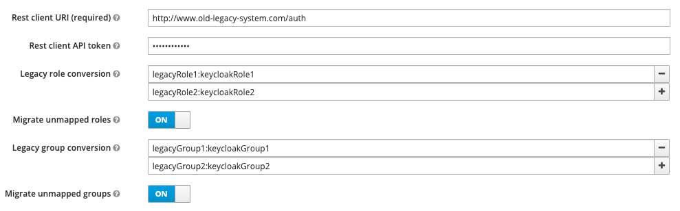

# Keycloak user migration example


## Introduction

This is an example of a user migration plugin for Keycloak

## Prerequisites - REST endpoints in the legacy system  

You must provide two REST endpoints (GET and PUT) in your legacy authentication system under the URI `${restClientUri
}/{$username}`, where `${restClientUri}` is a configurable base URL for the endpoints and `{$username}` is the
username of the user that is attempting to sign in.

### GET
The GET request will have to return user data as a JSON response in the form:
```json
{
    "username": "string",
    "email": "string",
    "firstName": "string",
    "lastName": "string",
    "isEnabled": "boolean",
    "isEmailVerified": "boolean",
    "attributes": {
      "key": ["value"]
    },
    "roles": ["string"]
}
```

Any HTTP status other than `200` will be interpreted as the user not having been found. 

### PUT
The PUT request is for password validation. It will have to accept the following body:
```json
{
    "password": "string"
}
```

...And return HTTP status 200 if the password is correct. Any other response will be treated as invalid credentials.

### Example REST client behavior

Let's assume we have configured the legacy REST service under the URL `http://www.old-legacy-system.com/auth`.

If a user with the username `bob` and the password `password123` tries to log in through Keycloak for the first time
(giving correct credentials), a GET request will be performed to `http://www.old-legacy-system.com/auth/bob`.
The response might look like this:
```json
{
    "username": "bob",
    "email": "bob@company.com",
    "firstName": "Bob",
    "lastName": "Smith",
    "isEnabled": "true",
    "isEmailVerified": "true",
    "attributes": {
      "position": ["rockstar-developer"],
      "likes": ["cats", "dogs", "cookies"]
    },
    "roles": ["admin"]
}
```

As the user has been found, a PUT request will not be performed to `http://www.old-legacy-system.com/auth/bob`, with
the body:
```json
{
    "password": "password123"
}
```

As this is the correct password, the user will be logged in. In the background, his information will be migrated to
Keycloak.

## Launching and configuring the example
1. Navigate to `./docker`
2. Execute `docker-compose up`
3. Open `http://localhost:8024/auth/admin/` in a browser
4. Log in with the credentials:
* User: `admin`
* Password: `admin`
5. Navigate to "User federation":


6. Choose "User migration using a REST client" from the "Add provider..." dropdown:


7. Provide the legacy system endpoint URI in the "Rest client URI" field:


8. Click "save":


User migration should now work - Keycloak will recognize all users from your legacy authentication system and migrate
them automatically.
 
## Optional - additional configuration

Additional configuration options are available for fine-tuning the migration. 



### Legacy role conversion

If role names in Keycloak do not perfectly match those in the legacy system, you can configure the provider to
automatically map legacy roles to Keycloak roles, by specifying the mapping in the format `legacyRole:keycloakRole`.

### Migrate unmapped roles

This switch can be toggled to decide whether roles which are not defined in the legacy role conversion map should be
 migrated anyway or simply ignored.  